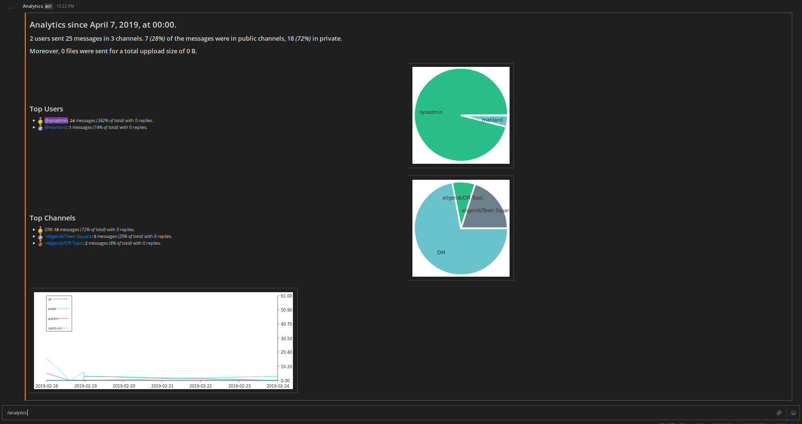

# Mattermost Plugin Analytics [](https://travis-ci.com/manland/mattermost-plugin-analytics)

This plugin displays analytics for your Mattermost instance. When you enter `/analytics` it responds with :



## Install

Download the [latest release](https://github.com/manland/mattermost-plugin-analytics/releases) and upload it via the [System Console](https://about.mattermost.com/default-plugin-uploads).

## Develop

```
make
```

This will produce a single plugin file (with support for multiple architectures) for upload to your Mattermost server:

```
dist/com.github.manland.mattermost-plugin-analytics-X.X.X.tar.gz
```

There is a build target to automate deploying and enabling the plugin to your server, but it requires configuration and [http](https://httpie.org/) to be installed:
```
export MM_SERVICESETTINGS_SITEURL=http://localhost:8065
export MM_ADMIN_USERNAME=admin
export MM_ADMIN_PASSWORD=password
make deploy
```

Alternatively, if you are running your `mattermost-server` out of a sibling directory by the same name, use the `deploy` target alone to  unpack the files into the right directory. You will need to restart your server and manually enable your plugin.

In production, deploy and upload your plugin via the [System Console](https://about.mattermost.com/default-plugin-uploads).
